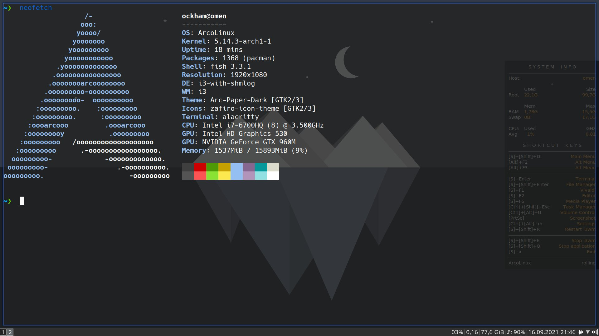

> Work in Progress

# Dotfiles

Este repositorio contiene los dotfiles de mi sistema ArcoLinux con i3. Utiliza [DotBot](https://github.com/anishathalye/dotbot) para gestionar los archivos. Usando el archivo `./install` se puede instalar automáticamente en los directorios correspondientes. Visita la [wiki de DotBot](https://github.com/ecarlson94/dotbot-template) para más información.

## Aplicaciones y dependencias
Los archivos de configuración de i3 tienen atajos de teclado que solo funcionarán con ciertos programas. La lista de programas a instalar y su fuente es la siguiente:

 - firefox*(pacman)*
 - drun*(pacman)*
 - alacritty*(pacman)*
 - dolphin*(pacman)*
 - fish*(pacman)*
 - polybar*(pacman)*
 - spotify*(AUR)*
 - conky*(pacman)*
 - feh*(pacman)*
 - libmpdclient *(pacman)*
 - ttf-font-awesome *(pacman)*
<<<<<<< HEAD
 - redshift *(pacman)*
 - geoclue *(pacman)*
 - gnome-keyring *(pacman)*
 - zscroll *(pacman)*
 - playerctld *(pacman)*
=======
 - i3lock-fancy-rapid-git *(AUR)*
>>>>>>> 57d9674dfd922b4ce4e24063ed6f0bc6f34880d7
